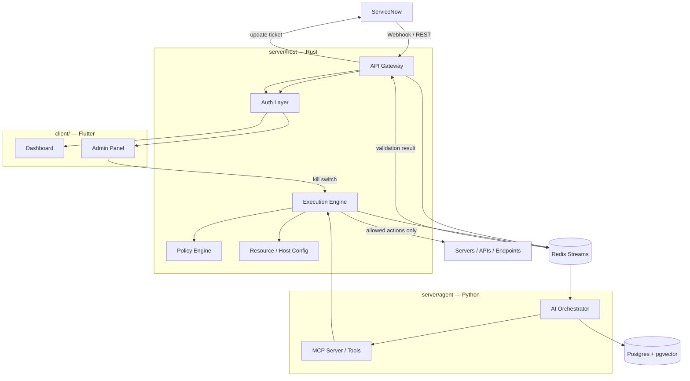

# KKS Infrastructure & Tech Stack

This document describes the concrete technology choices behind the
architecture described in the [README](../README.md). Each component
lists a one-liner for *why*/*how* it's used.

> Status: draft — stack decisions below are confirmed; anything still open
> is called out inline.

## 1. System Diagram

## 2. Frontend — `client/` (Flutter)

| Piece | One-liner |
|---|---|
| Flutter (single codebase) | Used to ship both the **Dashboard** and **Admin Panel** as one app (web + desktop) with shared widgets/state. |
| Dashboard | Read view of AI Sessions, Incident status, approval/execution history (per README §5–6). |
| Admin Panel | Ops-only surface: **kill switch** per agent/session, pause/resume workflows, view server/queue resource usage, billing/usage view. |
| State/Realtime | Dashboard subscribes to a WebSocket/SSE stream off the Rust gateway for live session/activity updates instead of polling. |

## 3. Backend

### 3.1 `server/host` (Rust)

| Piece | One-liner |
|---|---|
| API Gateway | Single Rust entrypoint (axum/actix) that ServiceNow webhooks and Flutter clients talk to; routes to internal services. |
| Auth layer | Split auth: SSO/OAuth for Flutter human users (dashboard/admin), separate mTLS/JWT for service-to-service calls between Rust/Python/Redis Streams. |
| Policy Engine | Rust module that classifies proposed actions (auto-approve / needs-human / never-auto) before they reach the Execution Engine. |
| Execution Engine | The only component with real permission to act; consumes *approved* action plans from Kafka and calls out to servers/APIs/endpoints. |
| Resource/Host Config | Tracks what servers/queues/workers exist and their current load, surfaced to the Admin Panel. |
| SQLx | Compile-time checked SQL against Postgres, used by every Rust service instead of an ORM; kept modular as one crate per service in a Cargo workspace. |
| Postgres (managed/online) | System of record for incidents, sessions, approvals, audit log, solution registry, and internal cost/usage counters (billing view is internal-only, no payments). |
| pgvector | Postgres extension used for KB embedding search — reuses the same Postgres + SQLx connection instead of standing up a separate vector DB service. |

### 3.2 `server/agent` (Python)

| Piece | One-liner |
|---|---|
| AI Orchestrator | Owns the reasoning loop: pulls an incident event, searches KB via pgvector, drafts a proposal with a confidence score. |
| MCP Server | Single shared MCP server exposing every approved "solution" as a tool (one registry, not one server per domain); the orchestrator calls tools through MCP instead of running arbitrary code. |
| pgvector client | Embeds incident text and queries Postgres for the closest known KB solution — no separate vector DB to manage. |

## 4. Data & Messaging

| Piece | One-liner |
|---|---|
| Redis Streams | Lightweight event bus decoupling "incident received" → "proposal ready" → "approved" → "executed" → "validated"; chosen over Kafka to avoid ZK/KRaft ops overhead for now, swappable later if scale demands it. |
| Postgres | Durable relational store (incidents, approvals, audit trail, solution registry, internal usage counters). |
| pgvector | Semantic search over the Knowledge Base (Postgres extension) so the orchestrator can find "closest known solution" instead of exact keyword match. |
| Solution registry | *(placeholder — naming/versioning scheme TBD)* rows in Postgres mapping a human-readable solution name → MCP tool + KB article + risk class. |

## 5. Missing Pieces Worth Adding

These weren't in the draft but are needed for the flow in the README to
actually work end-to-end:

| Piece | One-liner |
|---|---|
| Secrets management | Something like Vault/cloud secrets manager so Postgres/Redis/ServiceNow credentials aren't in plain config. |
| Observability | Tracing (OpenTelemetry) + metrics (Prometheus/Grafana) across Rust + Python so an AI session can be traced end-to-end. |
| Audit log | Append-only table (or hash-chained log) recording every proposal/approval/execution/validation for compliance. |
| Notifications | Slack/Teams/email hook for escalations so a failed validation doesn't sit silently. |
| CI/CD | Build/test/deploy pipeline per service (Rust workspace + Python agent + Flutter app) with migrations run via `sqlx migrate`. |
| Deployment | Single VM, no containers for now — services run directly (e.g. systemd units) to keep ops simple; revisit Docker/orchestration once there's more than one node. |
| Rate limiting / backpressure | On the API Gateway, so a ServiceNow burst can't overload the orchestrator. |
| Object storage | S3-compatible bucket for large execution logs/artifacts that don't belong in Postgres. |

## 6. Decisions & Open Questions

Resolved:

- Vector search: **pgvector**, not Cloudflare Vectorize/dedicated DB.
- Event bus: **Redis Streams**, not Kafka.
- MCP: **one shared MCP server**, not per-domain.
- Billing: **internal cost/usage tracking only**, no payment integration.
- Deployment: **single VM, no containers** for now.
- Auth: **split** — SSO/OAuth for humans, mTLS/JWT for services.

Still open:

1. **Solution registry naming**: deferred per your note — flagging so it isn't forgotten; current placeholder is a Postgres table keyed by a slug (e.g. `vpn-restart-clear-cache`).
2. **Redis Streams durability/HA**: single VM means Redis persistence (AOF) matters if the box restarts — need to confirm this is acceptable for MVP vs a managed Redis.
3. **SSO provider**: which identity provider for human auth (Azure AD, Okta, Auth0, self-hosted Keycloak)?
